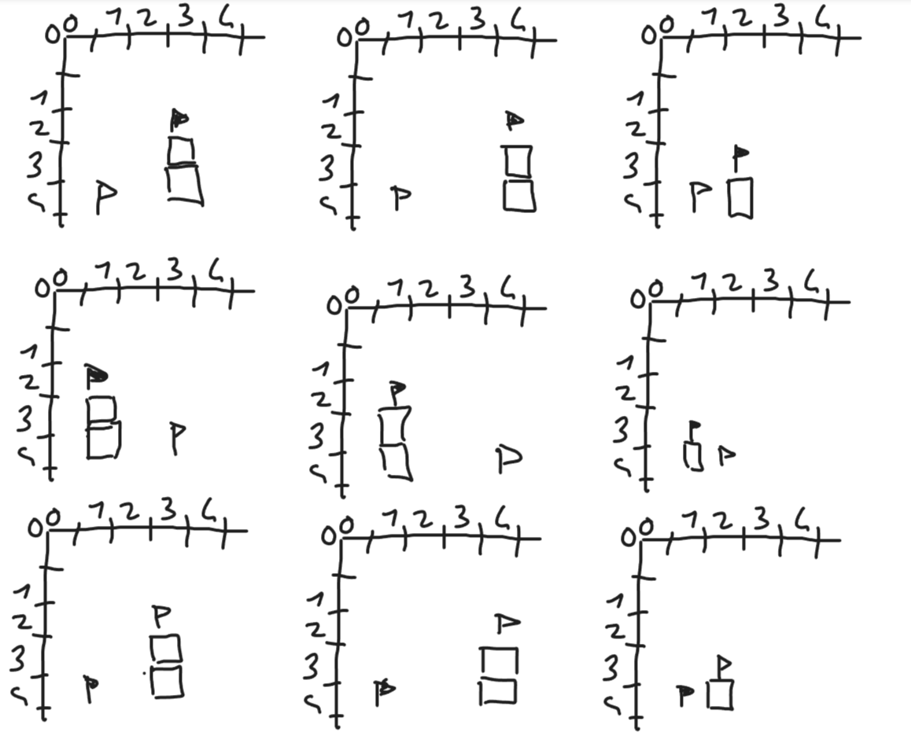
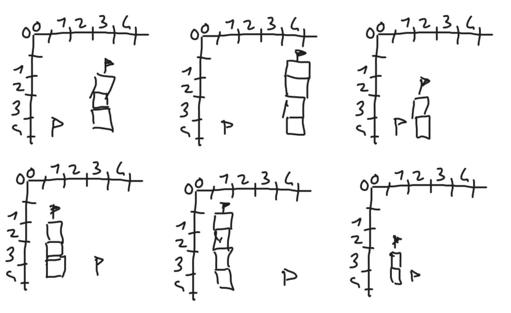
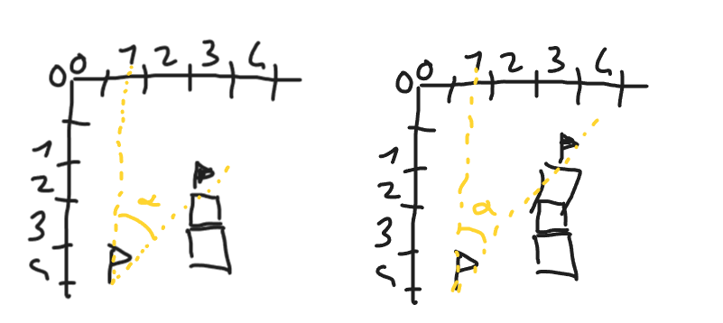
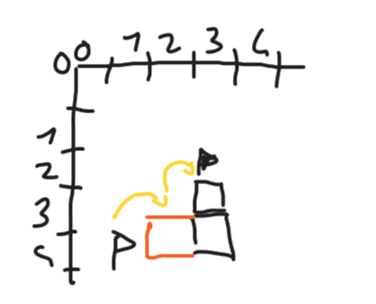
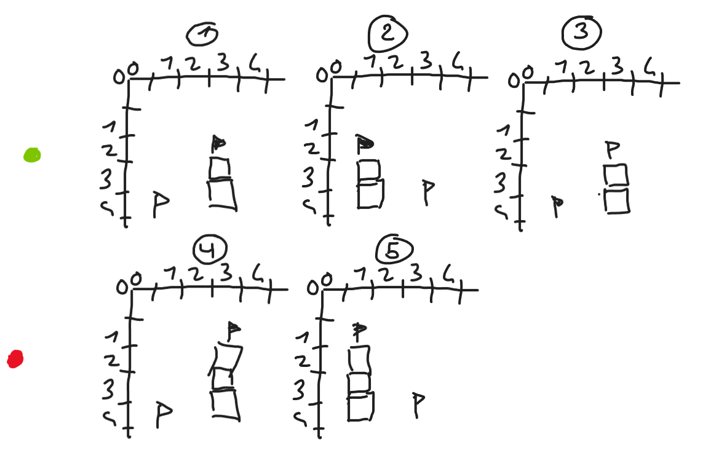
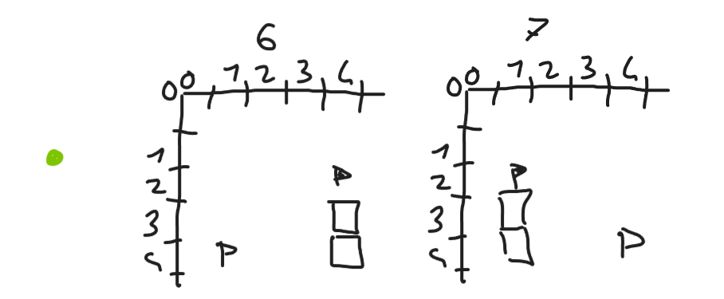
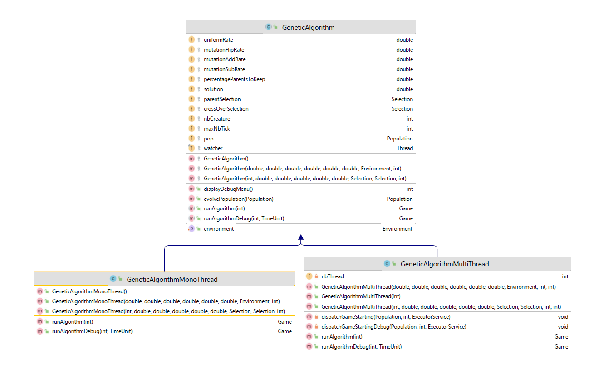

# Projet génétique

## Table des matières


## Introduction

​	Dans le cadre du cours portant sur les algorithmes génétiques, il nous a été demandé de réaliser un premier projet simulant un jeu où l'objectif est assez simple : Notre créature doit trouver le point d'arrivée et ce dernier est capable de mouvements assez simples.

Le jeu comporte donc :

- Une créature
  - Contient une suite de mouvement qu'il va réaliser en espérant arriver jusqu'au point d'arrivé
- Un environnement
  - Contient différents types d'éléments:
    - La créature : représente la position de la créature dans l'environnement
    - Le vide : représenté par un char vide, la créature peut avancer dans un espace vide
    - Un bloc : la créature ne peut pas prendre la place du bloc.
    - Drapeau d'arrivée et de départ: permet de visualiser la position de départ de la créature ainsi que la position que la créature doit rejoindre.

Je vais tout d'abord aborder la génération de l'environnement aléatoire que j'ai réalisé, ensuite mon implémentation du jeu pour terminer par mon implémentation de l'algorithme génétique de ce jeu.

## Génération de l'environnement

​	Comme dit précédemment, un environnement peut être composé de différents éléments tels que des bloc, deux drapeaux et des zones de vides.

Pour la génération de l'environnement de manière aléatoire, il est important que l'environnement généré comporte au moins une solution. Pour cela, il est important de déterminer si, à partir d'une position donnée, s'il est possible d'atteindre l'objectif. 

### Une solution est-elle possible ?

 L'idée a été de chercher une formule me permettant de déterminer si, à partir d'une position donnée, il m'était possible de trouver si une solution était possible, et ce même en ajoutant des blocs sur le chemin.

Pour aborder le problème, imaginons différents cas de figures:

- Les cas réalisables

  
- Les cas irréalisables

  

  #### Première approche

  ​	La première idée a été de calculer l'angle entre la position de départ (drapeau blanc) et l'objectif à atteindre (drapeau noir). 

  

  Le premier dessin comporte bien une solution et l'angle $\alpha$ est plus petit que l'angle $\alpha$ du deuxième dessin qui lui, ne comporte pas de solution.

  Penchons-nous sur le premier dessin. Ce dernier comporte bien au-moins une solution, mais en réalité, en comporte-t-il plusieurs?

  La réponse est non.

  #### La solution maximum limite

  Derrière ce nom tout droit sortie de mon imagination, se trouve en réalité l'expression que je trouvais la plus correcte pour déterminer le cas particulier où une seule solution est possible

  

  En effet, dans ce cas de figure la seule solution possible est l'ajout d'un bloc en (2;4) afin de permettre à la créature d'atteindre l'objectif.

  #### Deuxième approche

  ​	Attaquer le problème par l'angle formé entre le point de départ (ou la position de la créature à un instant t) est une idée qui, selon moi, se tient. Cependant, maintenant que nous avons connaissance de l'existence de la solution maximum limite, est-il possible d'établir mathématiquement une formule pour savoir si nous nous trouvons dans ce cas, ou bien s'il y a plusieurs solutions, voir qu'il n'y en ait pas et ce, a partir des coordonnées de l'objectif et des coordonnées du point de départ/ de la créature?

  Après quelques essais/erreurs, j'ai réussi à faire une formule très simple.
  
  $$
  \begin{align*}
  	&SML = \frac{arrive.x-depart.x}{arrive.y-depart.y} 
  \end{align*}
  $$
  
  Cette formule peut être illustré grâce aux exemples précédent :

  <u>Exemples :</u>

  

  1. $$
     \begin{align*}
     	&SML = \frac{3-1}{2-4} \\
     	&SML = -1
     \end{align*}
     $$

  2. $$
     \begin{align*}
     	&SML = \frac{1-3}{2-4}\\
         &SML = 1
     \end{align*}
     $$

  3. $$
     \begin{align*}
     	&SML = \frac{1-3}{4-2} \\
     	&SML = -1
     \end{align*}
     $$

  4. $$
     \begin{align*}
     	&SML = \frac{3-1}{1-4} \\
         &SML = \frac{2}{-3} = -0.66667
     \end{align*}
     $$

  5. $$
     \begin{align*}
     	&SML = \frac{1-3}{1-4} \\
         &SML = \frac{-2}{-3} = 0.66667 
     \end{align*}
     $$

- 



6. $$
   \begin{align*}
   	&SML = \frac{4-1}{2-4} \\
       &SML = \frac{3}{-2} = -1.5
   \end{align*}
   $$

7. $$
   \begin{align*}
   	&SML = \frac{1-4}{2-4} \\
       &SML = \frac{-3}{-2} = 1.5
   \end{align*}
   $$

##### Une solution est-elle donc possible?

Il est donc possible de déterminer l'existence ou non d'une solution grâce à la solution maximum limite. 

Pour cela, il faut que cette dernière soit:

- Soit strictement supérieure à 1 (SML > 1)
- Soit strictement inférieure à -1 (SML < -1)

Et ce en fonction de la position du point de départ par rapport au point d'arrivée

### Génération de l'environnement de manière aléatoire

Afin de réaliser l'environnement de manière aléatoire, je suis passé par deux approches, la première présentant un problème assez majeur que je n'ai su résoudre.

Cependant, les deux approches présentent tout de même des points communs.

#### Communs aux deux approches

​	L'une comme l'autre approche essaye de créer un environnement contenant au-moins une solution. Pour cela, il faut que dés le départ, la position de départ et d'arrivée soit correcte.

Pour cela, voici les différentes étapes afin de définir le point d'arrivée et de départ:

- Etablissement des coordonnées du point de départ de manière totalement aléatoire (mais qui entre tout de même dans la taille de l'environnement)
- Etablissement de la position du point d'arrivée sur l'axe des abscisses de manière aléatoire
- Etablissement de la valeur maximal que le point d'arrivée pourrait prendre sur l'axe des ordonnées afin de contenir au moins une solution
- Etablissement de la position du point d'arrivée sur l'axe des ordonnées (en fonction de la valeur trouvée précédemment)

Cependant, la génération aléatoire non-borné peut donner des environnements ne comportant que très peu de zones réellement utile. Imaginons un environnement de 50 de large, il se peut que l'arrivée et le départ ne se situe qu'à 2 blocs d'écart, ce qui est dommage.

Pour contrer cela, je force l'attribution aléatoire sur l'axe des abscisses des deux coordonnées sur le premier et le dernier quart de l'environnement, disposant ainsi de la casi intégralité du terrain.

<u>Note</u> : La gravité s'applique également aux éléments du terrains. Par cela j'entends que je n'ai pas implémenté de bloc volant ni de points d'arrivée/départ volant. Ces éléments seront obligatoirement succédés d'une suite de bloc descendant jusqu'au "sol".

#### Première approche

Une fois les points de départ et d'arrivée définit, l'idée a été de se dire : "*Pourquoi se contenter d'un seul terrain aléatoire alors que je pourrai tous les récupérer ?*".

L'idée a donc été de faire avancer une créature selon trois directions, et ce en fonction de la position de l'arrivée par rapport au départ (Par exemple, si l'arrivée se situe à droite du départ, la créature effectue des mouvements vers la droite, en haut à droite et en bas à droite, et vice versa).

A chaque mouvement, on évalue si l'arrivée est toujours atteignable, si tel est le cas, on envisage le cas où la créature tombe et le cas où un bloc se situerait en-dessous de la nouvelle position de la créature. Si la créature tombe, on passe en revu chaque position car un bloc pourrait se trouver en-dessous de chacune de ses positions etc. Pour chacune de ses positions (que la créature tombe ou non), on réenvisage les trois mouvements possibles, créant ainsi un très grand arbre.

<u>Le problème</u> a été que j'ai essayé de concevoir cet avancé de manière récursive. La JVM ne disposant pas d'un stack infini, un "*stackoverflow*" est très vite arrivé et il m'a donc été impossible de trouver tous les environnements possibles pour un point de départ et d'arrivée donnée.

#### Deuxième approche

La première approche ayant été un échec, je m'en suis inspiré pour créer la deuxième qui s'en rapproche sauf qu'elle ne me retourne qu'un seul environnement. 

La créature avance toujours selon trois mouvements défini de la même manière que précédemment, sauf que dans ce cas les trois mouvements ne seront pas testé mais un seul sera choisi de manière aléatoire. Si la nouvelle position de la créature est possible (que l'objectif est toujours atteignable) alors on continue.

Quid de la chute ? Grâce à la fonction gravité défini dans l'énoncé, une suite de position est récupéré. On choisit de manière aléatoire une de ses positions afin de voir si l'objectif est toujours atteignable, si tel est le cas, on y place un nouveau bloc en-dessous (pour arrêter la créature) et on reprend l'avancé.

## Jeu

Le jeu est conçu d'une manière assez simple. Ce dernier prend en paramètre une créature (doté d'une suite de mouvement) ainsi qu'un environnement.

Pour lancer le jeu, deux méthodes sont disponibles : 

- "*start*" : Exécute le jeu et affiche l'avancement de la créature à chaque étape 
- "*startNoDisplay*" : Exécute le jeu sans affichage ni pause (notamment utilisé par l'algorithme génétique)

## Algorithme génétique



L'implémentation s'est faite en trois temps:

- Implémentation de l'algorithme MonoThread
- Implémentation de l'algorithme MultiThread
- Implémentation de l'algorithme MultiThread avec une option debug et une exécution pas-à-pas

Note : L'implémentation est très fortement inspiré de l'exemple vu précédemment en cours.

### Algorithme MonoThread et MultiThread

La différence se situe donc au niveau de la fonction "runAlgorithm".

Dans les deux cas, la génération continue tant que le meilleur score n'atteint pas une valeur fixée préalablement ou bien que le nombre d'itération maximum n'ait pas été atteint.

Concernant la version <u>MonoThread</u>, tout est géré par un seul et même thread qui va lancer toutes les parties ("*Game*") une à une pour ensuite pouvoir avoir le meilleur score et commencer le processus d'évolution.

Concernant la version <u>MultiThread</u>, la partie "lancement de jeu" est parallélisé afin d'en augmenter la vitesse. Tout le reste étant géré par la suite par un seul et unique thread.

### Algorithme génétique pas-à-pas

Pour la version pas-à-pas, il n'y a pas de nombre d'itération maximum ni de score à atteindre. L'utilisateur décide, grâce aux commandes fournies dans l'énoncé, de relancer une génération, ou bien plusieurs à la fois et peut même visualiser en temps réel la partie qui obtient le meilleur score "au moment de la demande".

### Paramétrisation

​	N'aimant pas particulièrement les constructeurs très long ,j'ai décidé d'implémenter un parseur de fichier YAML contenant tous les paramètres.

```yaml
percentageParentsToKeep: 20.0
nbCreature: 500
solution: 0
nbThread: 4
parentSelection:
  method: "tournament"
  mp:
    tournamentSize: "10"
  rate: 0.25
evolveSelection:
  method: "tournament"
  mp:
    tournamentSize: "10"
  rate: 0.25
mutationFlipRate: 0.025
mutationAddRate: 0.025
mutationSubRate: 0.025
maxNbTick: 1000
```
## Un point sur la synchronisation
  - L'accès au score (lecture/écriture) a été protégé afin d'éviter toute lecture impropre.
  - Une variable "end" est utilisé pour le mode "debug" (ou pas-à-pas) afin que, lors de la demande de visualisation du meilleur <u>en cours d'exécution</u>, on puisse bel et bien récupérer une partie qui est entrain de se jouer. Cette variable "end" est mise à false lorsque la partie commence et est mise à "true" lorsque la partie se termine et est protégée.
  - La division des parties dans les différents threads n'est pas protégé au moyen d'un synchronize. Le vecteur contenant les différentes instances de Game est découpé et chaque thread n'accède qu'à une sous-partie de ce vecteur, n'interférent donc pas les uns avec les autres.
## Les tests
  Certaines parties "nouvelles" tel que la désérialisation de fichier YAML de config ont été testé proprement grâce à des tests unitaires. 
  L'algorithme génétique étant difficile à tester grâce à des tests unitaires traditionnels, ce dernier fut testé lors de différents tests habituelle lors de l'implémentation d'une nouvelle solution. Il en va de même pour la génération aléatoire de terrain.
## Optimisation des paramètres
  Afin de trouver les paramètres optimaux, douze boucles ont été utilisée afin de tester différentes valeurs pour chaque paramètres et leurs interactions les uns avec les autres.
  !! A terminer, génération des résultats en cours d'écriture !!

